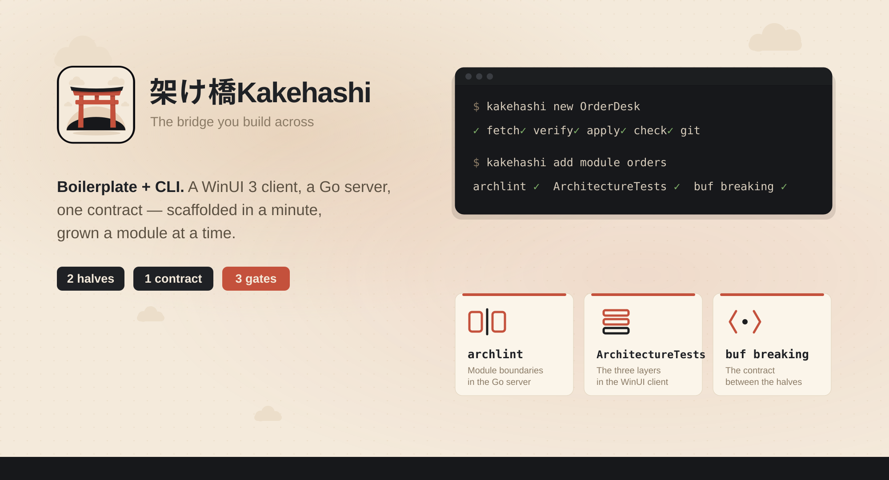

<p align="center">
  
</p>

<h1 align="center">Kakehashi</h1>

<p align="center">
  <b>A template for a Windows desktop app and the server behind it.</b><br>
  A WinUI 3 client, a Go backend that deploys to any Linux box, and one contract the build checks
  against both halves — with three linters that keep the shape after you start writing.
</p>

---

架け橋 — *the bridge you build across*. This repository is not an application; it is the starting
point for one. Every place it would name itself carries a placeholder, and a rename turns the whole
tree into your project.

## Three commands

```sh
go install github.com/SekiroKenjii/kakehashi/tools/cli/cmd/kakehashi@latest
kakehashi new                 # a wizard: name, module path, example module, sign-in, accent
cd orderdesk && docker compose up -d
```

Then run the client, and the Home page's Backend card reads **Connected**. Ten minutes later:

```sh
kakehashi add module orders   # both halves, the contract, the wiring — all three gates still green
```

That second command is the differentiator. The stack is replaceable; a generator that writes a
module across a client, a server and the contract between them, and leaves every architecture check
passing, is not something you get by copying a repository.

[**Getting started**](docs/getting-started.md) walks the whole of it at reading pace.

### The longer form

```sh
kakehashi new OrderDesk --module github.com/me/orderdesk --no-input
```

`kakehashi new` substitutes every placeholder, renames every path that holds one, removes the
template's own documentation, regenerates the contract, and **fails if anything is left behind** —
in a temporary directory, so a failure leaves nothing to clean up. `kakehashi doctor` says what the
machine is missing first, `--bare` leaves the example module out, and `--dry-run` prints the plan
and writes nothing.

With no `--template-version` it fetches the newest template this CLI is compatible with, verifies it
against the release's checksums and caches it. `--template-dir path/to/kakehashi` scaffolds from a
clone instead, which is what to pass before the first `template/vX.Y.Z` release is tagged.

Every command and flag: [docs/cli.md](docs/cli.md).

### Other ways to install

| | |
| --- | --- |
| `go install` | above; works from the moment a `tools/cli/v*` tag exists |
| GitHub Releases | binaries for Linux, macOS and Windows on amd64 and arm64, with `checksums.txt` |
| winget, scoop | manifests in [`packaging/`](packaging/), submitted per release |

Starting from the GitHub "Use this template" button instead? That gives you the repository with its
placeholders still in it, and no CLI. The rename scripts are the same algorithm, run in place:

```sh
tools/rename/rename.sh --app-name OrderDesk --go-module github.com/me/orderdesk
```

```pwsh
./tools/rename/rename.ps1 -AppName OrderDesk -GoModule github.com/me/orderdesk
```

They do what the scaffold does and refuse to finish while a placeholder survives, but nothing else:
no example-module removal, no manifest, and so no `add module` afterwards. The CLI is the supported
path; this is the fallback.

Either way:

```sh
docker compose up -d          # SQL Server, MongoDB, and the server
curl localhost:8080/healthz   # 200
```

```pwsh
dotnet run --project client/src/App/OrderDesk.App/OrderDesk.App.csproj -p:Platform=x64
```

The home page's Backend card reads **Connected**, and the Notes page writes, edits and deletes a
note through gRPC into SQL Server. That round trip is the whole point: the two halves are wired to
each other before you write a line.

## What you are starting from

| Gate | What it protects | Command |
| --- | --- | --- |
| `archlint` | module boundaries **inside** the Go server | `cd server && go run ./tools/archlint` |
| `<App>.ArchitectureTests` | the three layers **inside** the WinUI client | `cd client && dotnet test` |
| `buf breaking` | the contract **between** them | `buf breaking --against '.git#branch=main'` |

A modular monolith only stays modular if something checks. These three are what this template is
for; the stack is replaceable and the discipline is not. None is optional, and all three run on
every push.

```text
proto/          the contract. One directory per bounded context, versioned.
server/         Go modular monolith. Compiles to one static binary.
client/         WinUI 3 modular monolith. Ships as an .exe or an MSIX.
templates/      the scaffold's README and its removable units
tools/rename/   the rename scripts
docs/           why the pieces are shaped the way they are
```

## Placeholders

Literal text, substituted verbatim. No template engine, no conditional syntax in source files:
what you read in this repository is what compiles after the rename.

| Placeholder | Means | Default |
| --- | --- | --- |
| `__APP_NAME__` | PascalCase name — assemblies, projects, directories | required |
| `__APP_NAME_LOWER__` | lowercase — binary, database, compose project | derived |
| `__APP_NAME_UPPER__` | UPPERCASE — the environment-variable prefix | derived |
| `__APP_TITLE__` | display name — window titles, MSIX, sign-in copy | `__APP_NAME__` |
| `__ROOT_NAMESPACE__` | C# root namespace | `__APP_NAME__` |
| `__GO_MODULE__` | Go module path; the server is `__GO_MODULE__/server` | required |
| `__PROTO_PACKAGE__` | proto package root and its directory | lowercased name |
| `__ACCENT__` | accent colour | `#C4513C` |
| `__AUTHOR__`, `__YEAR__` | LICENSE and MSIX publisher | git config, this year |

Two things are deliberately **not** placeholders. `kakehashi:<section>:begin` markers and
`.kakehashi.json` are the generator's namespace rather than the application's: tooling reads them
in your project to add and remove modules, so the rename leaves them alone.

## Removing the example

The Notes module is one vertical slice across both halves, and it is removable as a unit —
`templates/units/notes.json` lists every path and every marker region that belongs to it. Deleting
it leaves a tree that still passes every gate.

## Building the template itself

This repository holds placeholders, so it does not build as it stands:

- `buf lint` rejects a proto package spelled `__PROTO_PACKAGE__` — no double underscore is
  lower_snake.case;
- the Go tool skips a directory beginning with an underscore when it expands `./...`;
- a C# namespace spelled `__ROOT_NAMESPACE__` violates IDE1006, and an underscore sorts before
  every letter, so the import order is wrong by construction.

All three clear the moment the tree is renamed, which is what CI does before it runs the gates —
see `.github/workflows/scaffold-smoke.yml`. The template is never merged unless a renamed copy of
it builds.

The rename regenerates what it cannot substitute: `buf generate`, because protoc derives Go symbol
names from the proto package, and `dotnet format`, because the analyzer sorts imports by namespace
and a new name sorts somewhere else.

## Where to look first

**Using it**

- [`docs/getting-started.md`](docs/getting-started.md) — nothing to a running app
- [`docs/first-module.md`](docs/first-module.md) — `add module`, then making it do something
- [`docs/remove-example.md`](docs/remove-example.md) — taking Notes back out
- [`docs/gates.md`](docs/gates.md) — the three gates, and how to read what each one prints
- [`docs/cli.md`](docs/cli.md) — every command and flag
- [`docs/faq.md`](docs/faq.md) — Windows only? A different database? Where does it deploy?

**How it is built**

- [`docs/BOILERPLATE.md`](docs/BOILERPLATE.md) — every file, classified: frame, example or identity
- [`docs/ARCHITECTURE.md`](docs/ARCHITECTURE.md) — the reasoning behind the shapes
- [`docs/CONTRACTS.md`](docs/CONTRACTS.md) — what the two halves promise each other
- [`docs/RBAC.md`](docs/RBAC.md) — who may do what, to which rows
- [`docs/NAVIGATION.md`](docs/NAVIGATION.md) — how the pane is arranged, and who decides what
- [`docs/adr/`](docs/adr/) — the decisions, including why the template ships one example module
- [`docs/brand/`](docs/brand/) — the mark, the palette, and why the accent is vermilion

**Contributing and releasing**

- [`CONTRIBUTING.md`](CONTRIBUTING.md) — the branching model
- [`docs/RELEASING.md`](docs/RELEASING.md) — the two version lines, the dry runs, the launch list
- [`CHANGELOG.template.md`](CHANGELOG.template.md) · [`CHANGELOG.cli.md`](CHANGELOG.cli.md)

## Licence

MIT. See [LICENSE](LICENSE) — the rename writes your name into it.
